# 🧑‍💼 Employee Leave Management System

## 📌 Overview

This project is a complete Employee Leave Management System developed using ASP.NET MVC.

It allows employees to apply for leaves and enables a structured multi-level approval workflow including Team Lead, Manager, and HR. The system also provides dashboard analytics and automated email notifications.

---

## 🚀 Features

### 👤 Employee Panel

* Apply Leave
* View Leave Dashboard
* Track Leave Status (Approved / Pending / Rejected)
* View Leave Summary (Paid, Unpaid, Sick, WFH, Half-day)

### 🧑‍💼 Manager / TL Panel

* Receive leave requests from team members
* Approve or Reject leave requests

### 🏢 HR Panel

* Final approval of leaves
* Manage all employee leave records
* Dashboard for leave analytics
* Department-wise leave management

---

## 🔄 Leave Approval Workflow

1. Employee applies for leave
2. Request goes to **Team Lead / Manager**
3. After approval → forwarded to **HR**
4. HR approves → leave is finalized
5. Email notification is sent to employee

### 📌 Special Cases

* TL leave → approved by HR
* HR leave → approved by higher authority
* Department-based routing:

  * Sales → Sales Manager
  * Digital → Digital Manager

---

## 📧 Email Notification System

* Email sent when:

  * Leave is applied
  * Leave is approved/rejected

* Notifications sent to:

  * Employee
  * Manager
  * HR

---

## 📊 Dashboard Features

* Total Leaves
* Remaining Leaves
* Work From Home (WFH)
* Monthly Attendance Table
* Leave Type Filters:

  * Paid
  * Unpaid
  * Casual
  * Sick
  * Half-day
  * WFH

---

## 🧠 My Contribution

* Designed multi-level leave approval workflow
* Implemented role-based access system
* Developed dashboard UI and leave tracking
* Integrated email notification system
* Managed department-based leave routing

---

## 🛠 Tech Stack

* ASP.NET MVC
* C#
* SQL Server
* Bootstrap
* JavaScript

---

## ⚠️ Note

This project demonstrates real-world HR workflow with role-based access and approval hierarchy.

---

## 📸 Screenshots

### 🧑‍💼 Employee Dashboard

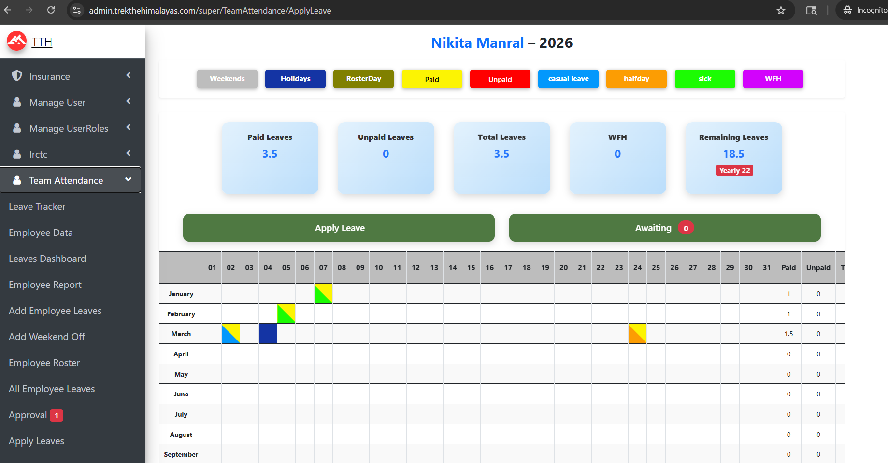

### 📝 Apply Leave

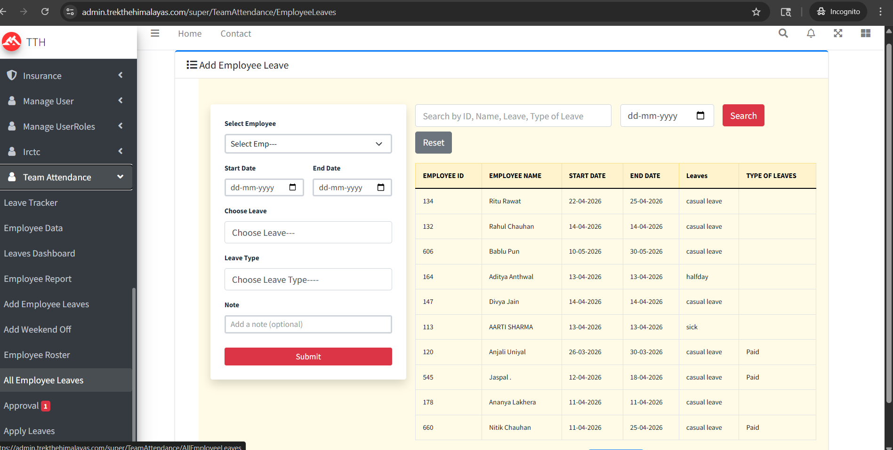

### 📋 Leave Details

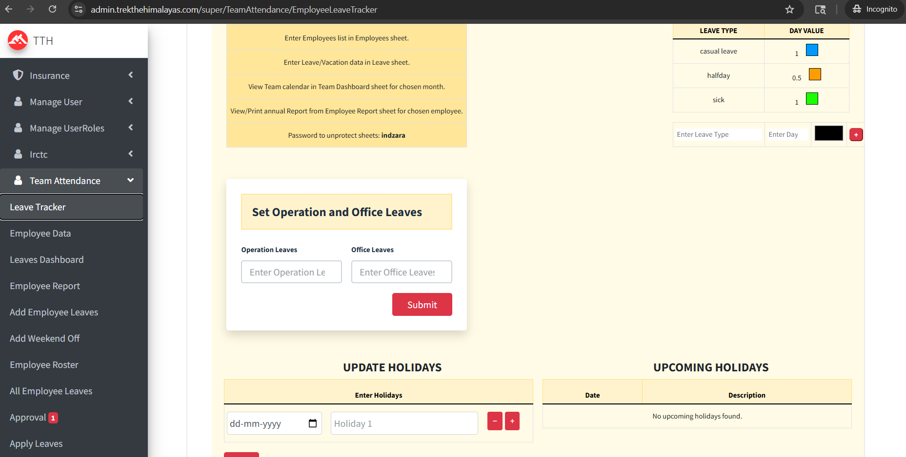

### ✅ Approval Panel

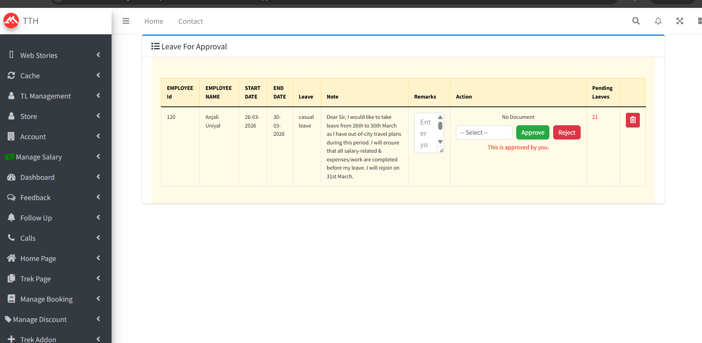

### 📊 Monthly Dashboard

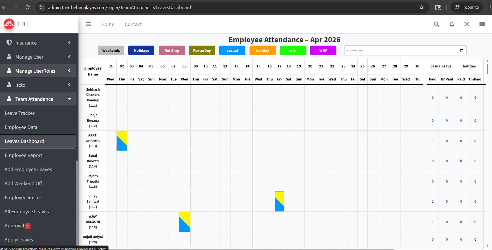

### 📄 All Leaves

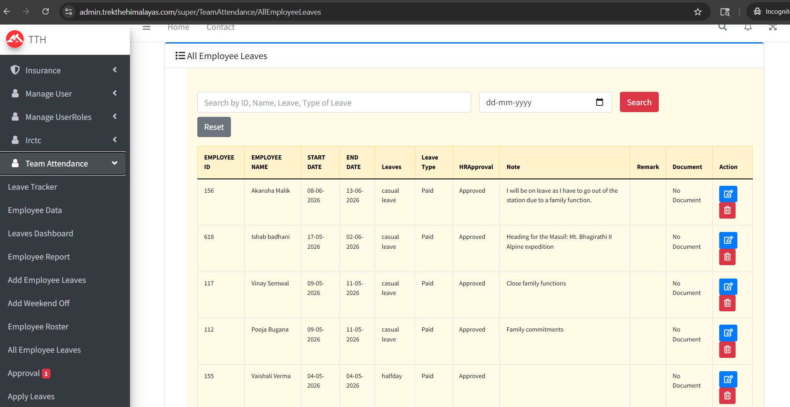

### 👥 Employee Details

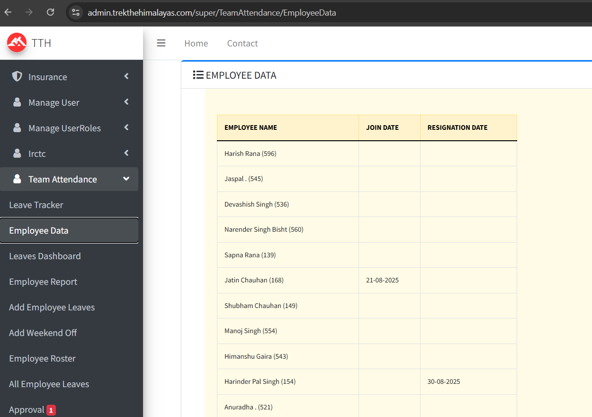

### 📈 Reports

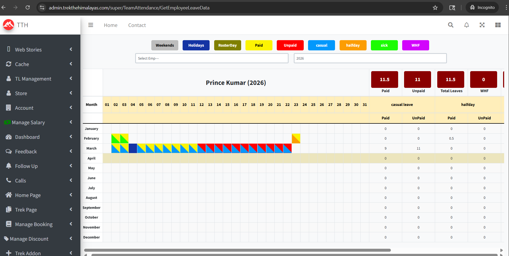

### 📅 Yearly Leave

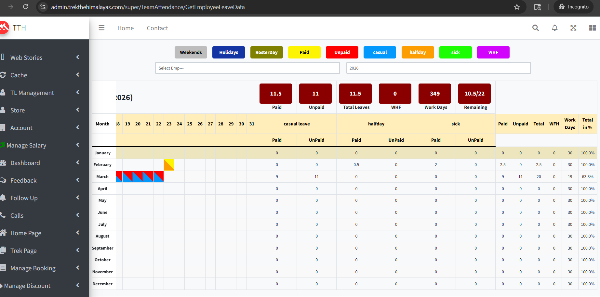

### ⚙️ Weekend Off Management

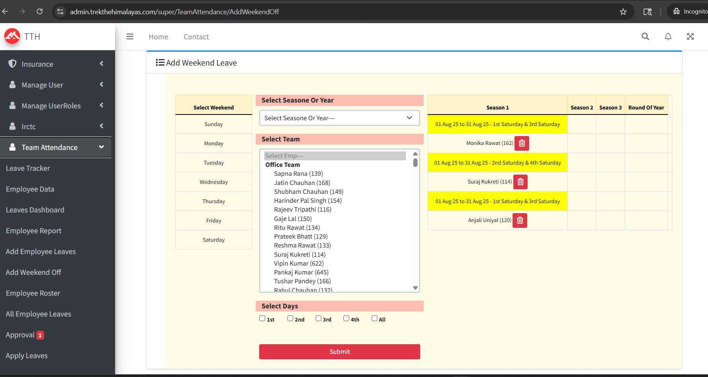

### 📆 Roster Management

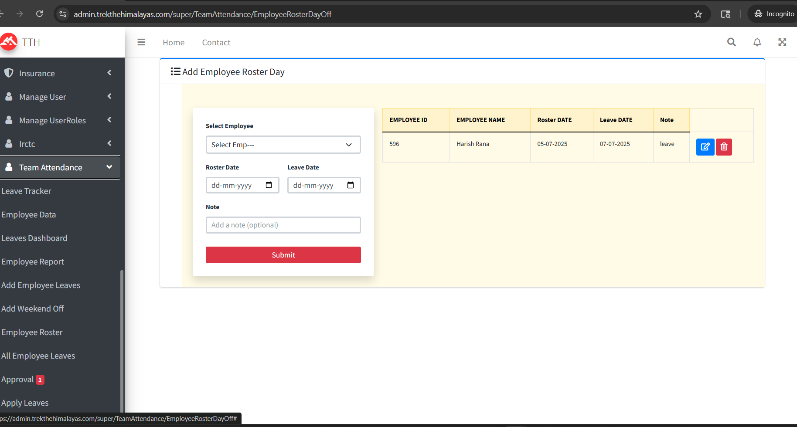
